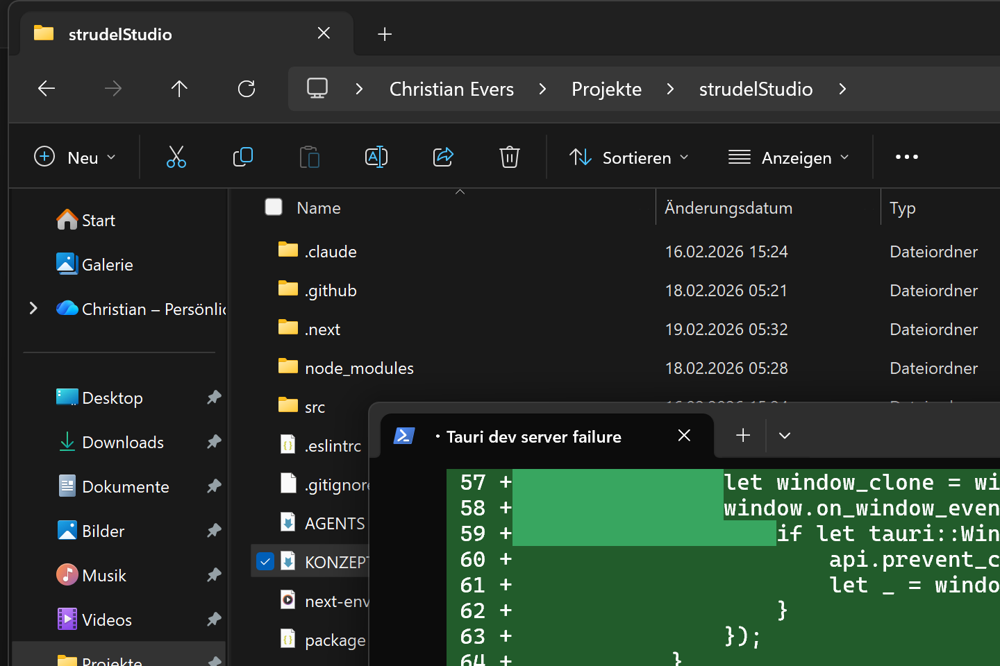

# Claude Code Dashboard

> A desktop app that turns your Claude Code session logs into cost & token analytics — so you always know what you're spending.



---

## Why

Claude Code writes detailed JSONL logs for every session to `~/.claude/projects/`. This data is sitting on your machine, but there's no built-in way to visualize it. Claude Code Dashboard reads those logs locally (no data ever leaves your machine) and gives you:

- **Cost per session and per project** — broken down by model
- **Token usage over time** — input, output, cache reads/writes
- **Daily spend chart** — spot your most expensive days at a glance
- **Active session view** — see what the current session is costing in real-time

---

## Download

### Free — Build from source
Clone the repo and run `npm run tauri build`. Requires Rust + Node.js (see [Development](#development)).

### Installer (19 €) — just double-click and go
Get the ready-to-run Windows installer (NSIS `.exe`) on Gumroad. No Rust toolchain needed.

**[→ Get the installer on Gumroad](https://gumroad.com/l/claudecodedashboard)**

macOS and Linux builds are available in [GitHub Releases](../../releases).

---

## Features

- Reads `~/.claude/projects/` — the same folder Claude Code writes to
- Parses all session `.jsonl` files including subagent logs
- Calculates costs using current Anthropic pricing (Opus 4 / Sonnet 4 / Haiku 4)
- SQLite cache — fast load on next launch, no re-parsing every time
- Works fully offline — zero network calls, no account required

---

## Supported Models & Pricing

| Model prefix | Input | Output | Cache write | Cache read |
|---|---|---|---|---|
| claude-opus-4 | $15 / M | $75 / M | $18.75 / M | $1.50 / M |
| claude-sonnet-4 | $3 / M | $15 / M | $3.75 / M | $0.30 / M |
| claude-haiku-4 | $0.80 / M | $4 / M | $1.00 / M | $0.08 / M |

Models are matched by prefix. Fallback pricing is Sonnet-level.

---

## Screenshots

_Add more screenshots here once available._

---

## Development

### Prerequisites

- [Rust](https://rustup.rs/) (stable toolchain)
- [Node.js](https://nodejs.org/) 20+
- On Windows: [Build Tools for Visual Studio](https://visualstudio.microsoft.com/visual-cpp-build-tools/) (C++ workload)
- On Linux: `webkit2gtk` and `libappindicator3` (see [Tauri docs](https://tauri.app/start/prerequisites/))

### Setup

```bash
git clone https://github.com/crsOne72/claudeCodeDashboard.git
cd claudeCodeDashboard
npm install
```

### Run in dev mode

```bash
npm run tauri dev
```

This starts a Vite dev server and a Tauri window. Hot reload works for the React frontend; Rust changes require a restart.

### Production build

```bash
npm run tauri build
```

Output is in `src-tauri/target/release/bundle/`. On Windows this produces an NSIS installer.

---

## Architecture

```
~/.claude/projects/{encoded-path}/{session-uuid}.jsonl
    → Rust parser  (src-tauri/src/commands/parser.rs)
    → Cost engine  (src-tauri/src/models.rs)
    → SQLite cache (src-tauri/src/db/mod.rs)
    → Tauri IPC    (src-tauri/src/commands/mod.rs)
    → React + Zustand + Recharts (src/)
```

The Tauri FS plugin scope is intentionally restricted to `$HOME/.claude/**`. All file access goes through Rust commands — the frontend never touches the filesystem directly.

---

## Contributing

Bug reports and feature requests are welcome — please use the [issue templates](.github/ISSUE_TEMPLATE/).

For code contributions, see [CONTRIBUTING.md](CONTRIBUTING.md).

---

## License

MIT — see [LICENSE](LICENSE).

---

## Acknowledgements

Built with [Tauri v2](https://tauri.app/), [React 19](https://react.dev/), [Recharts](https://recharts.org/), [Zustand](https://zustand-demo.pmnd.rs/), and [Tailwind CSS](https://tailwindcss.com/).
